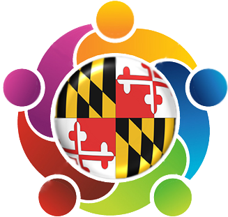

  

<b>
University of Maryland Group Processes Lab
</b>

- <a href="{{ site.baseurl }}/about">About</a>
- <a href="{{ site.baseurl }}/donate">Donate</a>
- <a href="{{ site.baseurl }}/RA_info">Information for Undergraduate Researchers</a>
- <a href="{{ site.baseurl }}/participate">Interested in Participating?</a>

## Location 

University of Maryland 
2112 Parren Mitchell Art-Sociology Building 
3834 Campus Dr 
College Park, MD 20742 

## Contact
<a href="https://socy.umd.edu/facultyprofile/Doan/Long"><b>Long Doan</b></a> 
Lab Director 
Assistant Professor of Sociology 
Art-Sociology Building 

<a href="https://socy.umd.edu/facultyprofile/Lucas/Jeff"><b>Jeff Lucas</b></a> 
Associate Dean of Research 
Professor of Sociology 
Art-Sociology Building 

<a href="https://socy.umd.edu/gradprofile/Rinderknecht/R.%20Gordon"><b>R. Gordon Rinderknecht</b></a> 
Assistant Lab Director 
Art-Sociology Building 
